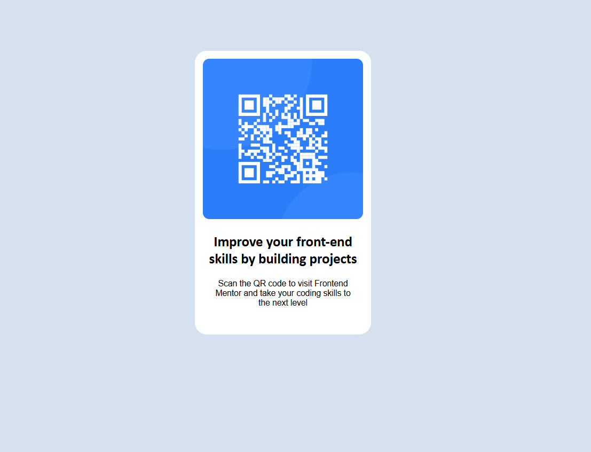

# Frontend Mentor - QR code component solution

This is a solution to the [QR code component challenge on Frontend Mentor](https://www.frontendmentor.io/challenges/qr-code-component-iux_sIO_H). Frontend Mentor challenges help you improve your coding skills by building realistic projects. 

## Table of contents

- ini adalah project sederhana saya, project ini merupakan challange yang diberikan oleh frontend mentor dimana kita ditantang untuk membuat sebuah card yang di dalam nya terdapat barcode dan 2 paragraf caption 

  - project sederhana ini dibuat dengan hanya menggunakan html dan css
  -
  - 

- [Author](#Fadhil Aditya)

## Overview

### Screenshot

### Links

- Live Site URL: [Add live site URL here](https://fadhilaa.netlify.app/)

## My process

- untuk saat ini saya sudah melakukan implementasi kode yang sesuai dengan desain yang diberikan, namun terdapat kendala dimana saya tidak dapat mengakses file figma yang telah disediakan sehingga untuk beberapa detail seperti pemilihan font, ukuran card dll masih tidak sesuai dengan desain.

### Built with

- Semantic HTML5 markup
- CSS 
- Flexbox

### What I learned

 beberapa hal yang saya pelajari dari project ini ternyata ada beberapa perilaku dari tag tag html sederhana yang baru saya ketahui yang sempat membuat hasilnya tidak sesuai dengan desain lalu saya mencari cara untuk menyelesaikannya 

### Continued development

untuk kedepannya mungkian akan menggunakan js agaar webnya lebih interaktif

## Author

- Website - [Fadhil Aditya](https://fadhilaa.netlify.app/)
- Frontend Mentor - [@yourusername](https://www.frontendmentor.io/profile/fadhiladityaa)
